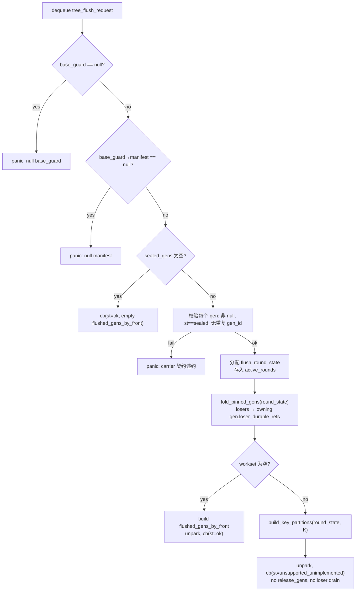

# 024 — Memtable Fold / Workset

> 实现第二十四步。落地 `flush_development_plan.md` Phase 4：在 Phase 3 冻结的 carrier 上实现第一段真正的 flush 算法 —— `fold_memtables_into_sorted_key_groups()`。
>
> Phase 3（step 023）冻结了全部 carrier 形状：`flush_key_group`、`flush_round_state`、`tree_flush_request / tree_flush_result`、`tree_sched` skeleton（`handle_tree_flush` 直接返回 `unsupported_unimplemented`）。Phase 4 是**第一个让 `tree_sched` 运行真正业务逻辑**的 step。
>
> Phase 0（设计同步）由 step 020 完成；Phase 1（front input / memtable common carrier）由 step 021 完成；Phase 2（geometry + read-domain pairing seam + worker skeleton）由 step 022 完成；Phase 3（manifest carrier + round state）由 step 023 完成。

## 本 step 覆盖的目标

| 目标 | 说明 |
|---|---|
| G1 | `tree_state` 新增 `active_rounds` map + `next_round_id` 计数器，让 round_state 在 flush 期间有 stable parking |
| G2 | `tree_sched::advance()` 从 Phase 3 stub 升级为完整的 handle：validate → park round_state → fold → partition → unpark → cb |
| G3 | `fold_pinned_gens()` — K-way merge fold：跨 pinned sealed gens 做 per-key winner 选取（`max(data_ver)`），loser 在 fold 期间**直接推入 owning gen 的 `loser_durable_refs`** |
| G4 | `build_key_partitions()` — 将 sorted workset 等量连续分成 P 个 `flush_key_partition`，为 Phase 5 lookup fanout 准备输入 |
| G5 | `flush_key_partition` carrier 新增，`flush_round_state.partitions` 字段新增 |
| G6 | `sealed_gens.empty()` 从 Phase 3 panic 降级为 `cb(st=ok, empty round)`（023 review §2 bullet 2 明确要求） |
| G7 | 新增 fail-fast：gen 非 sealed、重复 gen_id、null gen 指针 → `panic_inconsistency` |
| G8 | `memtable_gen` 新增 `front_owner_index` 字段；所有 ok 路径构建 `flushed_gens_by_front`，闭合 provenance 缺口 |

## 本 step 不覆盖

| 不做项 | 归属阶段 |
|---|---|
| `keys_to_leaf_groups()` lookup 映射算法 | Phase 5 |
| old leaf read / merge / candidate build | Phase 6 |
| tree delta planning / bounded writes / device flush | Phase 7 |
| leaf split / parent rewrite / root change | Phase 8 |
| `tree_state.flush_max_lsn` 推进 | Phase 7（Phase 4 无 tree 写入） |
| `frontier_switch` / `release_gens` 对 result 的消费 | Phase 7 后 |
| cache ownership migration | 独立 step |
| recovery 文档同步 | 独立 step（022/023 review 已三次提醒） |
| doc-sync Δ-1 / Δ-2（023 遗留） | 独立 step |

> 反面规则同 022/023：实现 Phase 4 时如果发现"必须顺便做一点 leaf mapping / 写盘 / frontier switch 才能跑通"，那是越界信号——停下来把它挪到对应 step，不要在本 step 中偷带。

## 设计目标

1. **fold 算法是独立 free function，不嵌入 `tree_sched::advance()` 体内**。`advance()` 做的是 dequeue + validate + 分配 round_state + 调 fold + 调 partition + unpark + cb；fold / partition 的纯算法逻辑放 `tree/memtable_fold.hh`，独立可测。
2. **fold 不复制 key bytes，不复制 value body**（FF §3.3 约束 1）。`flush_key_group.key` 是 `string_view` 进 winner gen 的 `kv_arena`；`winner_value` 是 POD `value_handle`。pin chain 保证生命周期。
3. **loser 在 fold 期间直接推入 owning gen**。`loser_durable_refs` 是 memtable-only loser 的正式挂接点；Phase 4 不再引入额外 staging carrier。若 unfinished round 在同一 sealed gen 上重试，允许在 fold 开头 `clear()` 后按本轮结果重建。这要求同一个 sealed gen 不能同时属于两个 in-flight flush rounds。
4. **round_state 是 workset / partition 的唯一 owning side**（023 §6 延续）。`workset`、`partitions` 都活在 `flush_round_state` 上；Phase 5 lookup fanout 的 `flush_lookup_req.groups` span 借自 `round_state.workset`。loser 不放在 round_state 内，直接挂到 owning gen。
5. **非空 round 返回 `unsupported_unimplemented`**（Phase 5-7 下游未实现）；**空 round 返回 `ok`**（含正确的 `flushed_gens_by_front`）。Phase 4 不偷做任何下游 stage。
6. **所有 ok 路径必须构建 `flushed_gens_by_front`**。empty-workset ok 路径也有非空 sealed_gens（空 gen 允许 seal，见 RSM §479），outer flow 的 `release_gens` 依赖 `flushed_gens_by_front` 才能正确释放。`memtable_gen.front_owner_index` 是 provenance 来源。

## 设计决策

| # | 决策点 | 结果 | 说明 |
|---|---|---|---|
| `D1` | `tree_state.active_rounds` 容器 | `absl::flat_hash_map<uint64_t, std::unique_ptr<flush_round_state>>` | key 是 `flush_round_id.v`（`flush_round_id` 无 `AbslHashValue`，直接用 `.v`）；unique_ptr 保证 round_state 地址稳定，span borrow 安全 |
| `D2` | `tree_state.next_round_id` | `uint64_t next_round_id = 1;` | 单调递增；0 保留为"无 round"哨兵 |
| `D3` | fold 算法文件位置 | `apps/inconel/tree/memtable_fold.hh`（新文件，header-only） | 独立头文件，两个 `inline` free function，不依赖 tree_sched 内部；可独立测试。标记 `inline` 保证 ODR 安全——owner_scheduler.hh 和测试文件都会 include 它，与项目 convention 一致（advance() 同样定义在 .hh 内） |
| `D4` | fold 算法形态 | K-way 线性扫描合并，O(N × K)，K = gen 数（典型 ≤ 8） | 每步从所有未耗尽的 gen iterator 中找最小 key（线性扫描 K 个 iterator），收集同 key 全部 entries，选 `max(data_ver)` winner |
| `D5` | `flush_key_partition` 位置 | `tree/flush_types.hh` 内新增 | 与其他 flush carrier 放在一起，Phase 5 直接消费 |
| `D6` | `flush_round_state.partitions` 字段 | `std::vector<flush_key_partition>` | 追加在 Phase 4 workset 注释块后；span 借自 `workset`，workset 在 `build_key_partitions` 后不再 mutate |
| `D7` | partition 算法 | 等量连续分区：`P = min(lookup_count, workset.size())`，partition `i` 覆盖 `workset[floor(i*N/P) .. floor((i+1)*N/P))` | 保证分区 span 连续指向 workset 内存；仅产出非空分区 |
| `D8` | `sealed_gens.empty()` 处理 | 降级为 `cb(st=ok, empty round)`，不 panic | 023 review §2 bullet 2 明确要求：Phase 4 引入合法 empty-round → fast path success 语义 |
| `D9` | 新增 fail-fast：gen `st != sealed` | `panic_inconsistency` | 非 sealed gen 的 table 可能仍在被修改，fold 读到不一致数据 |
| `D10` | 新增 fail-fast：`sealed_gens` 重复 `gen_id` | `panic_inconsistency` | 重复 fold 同一 gen 会 double-push losers，违反 FF §5.5 |
| `D11` | 新增 fail-fast：`sealed_gens[i] == nullptr` | `panic_inconsistency` | null gen 是调用方 bug |
| `D12` | 新增 fail-fast：`registry::tree_lookup_count() == 0` | `panic_inconsistency` | runtime 配置错误，无 lookup shard 可分配 partition |
| `D13` | round_state park / unpark 时机 | park 在 fold 之前（validate 通过后立即分配 + 存入 `active_rounds`）；unpark 在 cb 之前（从 `active_rounds` 移除） | Phase 4 的 round 是同步完成的（fold + partition 全在 `advance()` 单次 tick 内），所以 park → unpark 在同一次 advance 中发生。Phase 5+ 引入异步 fanout 后 round 会跨多次 advance tick，那时 unpark 时机推迟到 `finish_flush_round`（Phase 7） |
| `D14` | 非空 round 的 result | `unsupported_unimplemented` | Phase 5-7 下游未实现；round_state 已 unpark（释放），fold 产物不持久 |
| `D15` | 同 gen 内同 key 多条 entry 的 winner | 取 `max(data_ver)` | gen 内 `InlinedVector<memtable_entry, 1>` 可包含同 key 多条 entry（来自多个 batch）；gen 内 entries 的 data_ver 严格递增 |
| `D16` | loser 挂接时机 | **direct-push into owning gen** | fold 期间直接执行 `gen->loser_durable_refs.push(rvr)`。若 unfinished round 在同一 sealed gen 上重试，则 fold 开头 `gen->loser_durable_refs.clear()` 后按本轮结果重建。这样少一个 staging vector、少一次 Phase 7 commit pass，但要求同一个 sealed gen 不得同时属于两个 in-flight flush rounds |
| `D17` | `memtable_gen.front_owner_index` | `uint32_t front_owner_index = UINT32_MAX;`（新增字段，invalid sentinel 默认值） | 每个 gen 属于恰好一个 front；front_sched 在创建 gen 时赋值自身 index。默认 `UINT32_MAX` 是 invalid sentinel：`build_flushed_gens_by_front()` 遇到 `UINT32_MAX` 直接 `panic_inconsistency`——任何漏初始化都 fail-fast，不会被静默归到 front 0 |
| `D18` | `flushed_gens_by_front` 构建 | handle 中从 `pinned_gens` 遍历 `gen.front_owner_index` 分组构建 | 所有 ok 路径（sealed_gens.empty()、empty-workset、future success）都必须 populate 此字段，否则 outer flow 无法 release_gens。Phase 4 在 ok 路径上构建它，unsupported 路径不需要 |
| `D19` | empty-delta success 的 consumer 语义 | **`new_manifest = base_guard->manifest`（原样回传），outer flow 走统一 success 路径** | empty delta 意味着"所有 sealed gens 没有产生任何 tree 变更"，但 outer flow 仍然需要 release 这些 gens + 推进 durable_lsn。返回 `new_manifest = base_guard->manifest` 而不是 nullptr 让 frontier_switch 可以走同一条 `install_cat(new_manifest)` 路径而不需要 special-case "跳过 frontier_switch"。Phase 4 在 empty-workset ok 路径填 `new_manifest = round.pinned_base_guard->manifest` |
| `D20` | sealed gen 与 active round 归属 | **同一个 sealed `memtable_gen` 不得同时属于两个 in-flight flush rounds** | direct-push + retry clear 的前提。如果同一 gen 同时进两个 active rounds，一个 round 的 `clear()` 会擦掉另一个 round 已挂接的 losers |

## 详细设计

### 0. `core/memtable.hh` — `memtable_gen` 新增 `front_owner_index`（D17）

```cpp
struct memtable_gen {
    uint64_t gen_id;

    enum class state : uint8_t {
        active,
        sealed,
    } st;

    uint32_t front_owner_index = UINT32_MAX;  // NEW (Phase 4 D17)
                                               // UINT32_MAX = invalid sentinel

    uint64_t min_lsn = UINT64_MAX;
    uint64_t max_lsn = 0;
    // ... (rest unchanged)
};
```

约束：

1. **默认 `UINT32_MAX` 是 invalid sentinel**。任何漏初始化的 gen 进入 `build_flushed_gens_by_front()` 时会被 `panic_inconsistency` 拦住，不会被静默归到 front 0。
2. `front_owner_index` 由 `front_sched` 在 `make_shared<memtable_gen>(...)` 时从自身 `registry::front_index(core_id)` 赋值。Phase 4 不改 front_sched；只在 memtable_gen 上加字段，front 侧的赋值最迟在 coord → tree_flush 路径接通时补齐。
3. **所有测试 helper 必须显式填 `front_owner_index`**，禁止靠默认值跑过。测试中单 front 场景赋 0 即可。

### 1. `tree/flush_types.hh` — 新增 `flush_key_partition`

在 `flush_key_group` 定义之后、`flush_lookup_req` 之前追加：

```cpp
// ── partition plan for Phase 5 lookup dispatch ──────────────
//
// Phase 4 `build_key_partitions()` produces one partition per
// lookup shard. Each partition's `groups` span borrows
// contiguous elements from `flush_round_state.workset`. The
// span is valid as long as the round_state exists AND the
// workset vector is not reallocated after partitioning.
//
// Phase 5 `dispatch_key_partitions_to_lookup()` fans out these
// partitions, converting each into a `flush_lookup_req` with
// `groups` pointing at the same span.

struct flush_key_partition {
    uint32_t                          read_domain_index;
    std::span<const flush_key_group>  groups;  // borrows from flush_round_state.workset
};
```

约束：

1. `groups` 语义与 `flush_lookup_req.groups` 完全一致——都借自 `flush_round_state.workset`。Phase 5 在构造 `flush_lookup_req` 时直接复制 span 字段。
2. `read_domain_index` 对应 `registry::tree_lookup_scheds.list[i]`，等量分区保证 `i ∈ [0, P)`。

### 2. `tree/flush_round_state.hh` — 新增 `partitions`

在 `workset` 字段之后、Phase 5 段之前追加：

```cpp
// ── populated by Phase 4 (partition plan for Phase 5 lookup fanout) ──
//
// Stable as long as workset is not reallocated after
// `build_key_partitions()` completes. Each partition's `groups`
// span points into `workset` above.
std::vector<flush_key_partition> partitions;

```

约束：

1. `partitions` 必须在 `workset` 之后声明，保持 phase 推进顺序（023 §6 约束 4）。
2. Phase 5 可以直接遍历 `round_state.partitions` 构造 fanout，不需要再算一次分区。
3. loser 不放在 round_state；fold 期间直接挂到 owning gen 的 `loser_durable_refs`。round_state 只持有 workset / partitions 等跨 phase 的 borrow backing storage。

### 3. `tree_state` 新增字段

在 `tree/owner_scheduler.hh` 的 `tree_state` 结构体内、`reclaim_q` 之后追加：

```cpp
// ── Phase 4: active flush rounds (D1/D2) ─────────────────
//
// Key is `flush_round_id.v` (uint64_t).
// `flush_round_id` has no `AbslHashValue`; `.v` is used
// directly as hash key.
//
// Phase 4 round lifecycle: park at fold start, unpark at fold
// end (same advance tick). Phase 5+ will extend the window
// across multiple advance ticks when async fanout is introduced.
absl::flat_hash_map<uint64_t, std::unique_ptr<flush_round_state>>
    active_rounds;
uint64_t next_round_id = 1;
```

约束：

1. Phase 3 的 SFINAE 测试断言这两个字段不存在。Phase 4 加上它们后该测试会 fail——这是 023 review §3 bullet 3 明确的交接信号，Phase 4 测试必须翻转检查。
2. `active_rounds` 只被 `tree_sched::advance()` 单线程访问（RSM §4.1 单线程不变量），不需要锁。

### 4. `tree/memtable_fold.hh` — 新文件（header-only, inline）

独立头文件，包含两个 `inline` free function。不依赖 `tree_sched`、不依赖 `registry`。`inline` 关键字保证 ODR 安全——`owner_scheduler.hh` 和测试文件都会 `#include` 此头文件（与项目 convention 一致：`advance()` 同样在 .hh 内定义）。

#### 4.1 `inline void fold_pinned_gens(flush_round_state& rs)`

算法（FF §3.3 对应实现，loser direct-push 见 D16）：

```text
输入：rs.pinned_gens[]，每个 gen 的 table 是
      btree_map<string_view, InlinedVector<memtable_entry, 1>>，已按 key 排序。

步骤：
1. 为每个 gen 维护一个 btree_map::const_iterator（指向当前位置）。
   构造 iters[K]，初始各指向 gen.table.begin()。

2. 循环直到所有 iterator 耗尽：
   a. 在所有未耗尽的 iterator 中找字典序最小的 key（线性扫描 K 个）。
   b. 收集所有 gen 中 key 相同的全部 entries（推进匹配的 iterator）。
      注意：单 gen 内同 key 的 InlinedVector 可能有多条 entry。
   c. 在所有收集的 entries 中选 winner：max(data_ver)。
      - 跨 gen：同一 key 不可能有相同 data_ver（batch_lsn 无间隙、
        每个 batch 将一个 key 路由到恰好一个 front）。
      - 单 gen 内：InlinedVector 内 entries 的 data_ver 严格递增。
      - 因此 max(data_ver) 保证唯一 winner。
   d. 对每个非 winner entry：
      - 如果 kind == value：直接执行
            `rs.pinned_gens[loser_gen_index]->loser_durable_refs.push(
                { entry.vh.durable, entry.data_ver })`
      - 如果 kind == tombstone：不推入（tombstone 无 durable value_ref）。
   e. 产出 flush_key_group 追加到 rs.workset：
      {
        key:              winner entry 的 key（string_view 进 winner gen kv_arena），
        winner_data_ver:  winner 的 data_ver，
        winner_kind:      winner 的 kind，
        winner_value:     winner 的 value_handle（仅 kind::value 时有效），
        winner_pinned_gen_index: winner 在 pinned_gens[] 中的下标（uint32_t，borrowed）
      }

输出：
  - rs.workset 被填充为按 key 升序排列的 flush_key_group[]。
  - value loser 已直接挂接到各自 owning gen 的 `loser_durable_refs`。

复杂度：O(N × K)，N = 跨全部 gen 的唯一 key 总数，K = gen 数。
         K 通常 ≤ 8。后台 flush 任务，不在热路径上。
```

实现要点：

1. **不分配额外 key 存储**。winner 的 `key` 直接复用 gen kv_arena 中的 `string_view`。
2. **winner 通过 `uint32_t winner_pinned_gen_index` 借用**。`round_state.pinned_gens` 整轮 pin 住全部 gen 的 kv_arena，workset 不持有额外 shared_ptr，零 refcount bump。Phase 5-7 消费方通过 `pinned_gens[idx]` 间接访问 gen。
3. **利用 InlinedVector 内 data_ver 严格递增**。`back()` 是 gen-local winner（O(1)），前 n-1 条直接作为 intra-gen losers 推入 gen（零比较）。跨 gen 只比较 K 个 gen-local winners。
4. **不需要外部排序**。btree_map 已按 key 排序；K-way merge 天然产出排序结果。
5. **loser 直接挂到 gen，但不提前触发回收**。`loser_durable_refs` 是正式 retire list；只要 gen 没 release、`recovery_safe_lsn` 没满足，就不会进入实际 reclaim。unfinished retry 若发生在同一 sealed gen 上，允许 `clear()+rebuild`。

#### 4.2 `inline void build_key_partitions(flush_round_state& rs, uint32_t lookup_count)`

算法：

```text
输入：rs.workset（已由 fold_pinned_gens 填充，不可再 mutate）。
      lookup_count（来自 registry::tree_lookup_count()）。

步骤：
1. N = rs.workset.size()
2. P = min(lookup_count, N)
   - 如果 P == 0，直接返回（workset 为空时不应调用此函数）
3. 对 i ∈ [0, P)：
   start = floor(i * N / P)
   end   = floor((i+1) * N / P)
   如果 start < end：
     rs.partitions.push_back({
       .read_domain_index = static_cast<uint32_t>(i),
       .groups = std::span<const flush_key_group>(
                     rs.workset.data() + start, end - start),
     })

输出：rs.partitions 被填充。每个 partition 的 groups span 连续指向 workset 内存。

前置条件：workset 已完全填充且之后不再 push_back（否则 vector 重分配使 span 失效）。
后置条件：所有 partition 的 groups 覆盖 workset 全部元素，无重叠、无遗漏。
```

约束：

1. 必须在 `fold_pinned_gens` 返回后调用。
2. `rs.workset.reserve()` 可以在 fold 之前做（如果能估算 key 总数的话），但不是 Phase 4 的强制要求——vector 的 amortized push_back 在后台 flush 可接受。

### 5. 重写 `tree_sched::advance()`

用以下逻辑替换 Phase 3 的 stub。

辅助函数（在 advance 之前定义，或 advance 内 lambda）：

```cpp
// 从 pinned_gens 按 front_owner_index 分组构建 flushed_gens_by_front（D18）。
// Phase 4 所有 ok 路径都调用此函数。
// front_owner_index == UINT32_MAX 表示漏初始化 → panic（D17）。
static inline auto
build_flushed_gens_by_front(
    const absl::InlinedVector<std::shared_ptr<core::memtable_gen>, 8>& gens)
{
    absl::flat_hash_map<uint32_t,
                        absl::InlinedVector<std::shared_ptr<core::memtable_gen>, 8>>
        result;
    for (const auto& g : gens) {
        if (g->front_owner_index == UINT32_MAX)
            core::panic_inconsistency(
                "build_flushed_gens_by_front",
                "memtable_gen.front_owner_index not initialized");
        result[g->front_owner_index].push_back(g);
    }
    return result;
}
```

主逻辑：

```text
bool tree_sched::advance() {
    bool progress = false;
    for (uint32_t i = 0; i < kMaxFlushOpsPerAdvance; ++i) {
        auto item = flush_q.try_dequeue();
        if (!item) break;
        auto* r = *item;

        // ── 阶段 1：输入校验 ──

        // (1) base_guard 非 null → panic（与 Phase 3 相同）
        if (r->args.base_guard == nullptr)
            panic_inconsistency("tree::tree_sched::advance",
                "tree_flush_request.base_guard is null");

        // (2) base_guard->manifest 非 null → panic（与 Phase 3 相同, 023 review M-1）
        if (r->args.base_guard->manifest == nullptr)
            panic_inconsistency("tree::tree_sched::advance",
                "tree_flush_request.base_guard->manifest is null");

        // (3) sealed_gens 为空 → fast path success（D8, 从 Phase 3 panic 降级）
        //     空 sealed_gens 意味着无 gen 需要 release，flushed_gens_by_front 为空。
        if (r->args.sealed_gens.empty()) {
            tree_flush_result res{
                .st = flush_stage_status::ok,
                .flushed_gens_by_front = {},  // 无 gen
                .flushed_max_lsn = 0,
            };
            r->cb(std::move(res));
            delete r;
            progress = true;
            continue;
        }

        // (4) 逐 gen 校验：非 null、st == sealed、无重复 gen_id → panic
        {
            absl::flat_hash_set<uint64_t> seen_ids;
            for (const auto& g : r->args.sealed_gens) {
                if (g == nullptr)
                    panic_inconsistency("tree::tree_sched::advance",
                        "sealed_gens contains null gen");
                if (g->st != core::memtable_gen::state::sealed)
                    panic_inconsistency("tree::tree_sched::advance",
                        "sealed_gens contains non-sealed gen");
                if (!seen_ids.insert(g->gen_id).second)
                    panic_inconsistency("tree::tree_sched::advance",
                        "sealed_gens contains duplicate gen_id");
            }
        }

        // ── 阶段 2：分配 round_state 并 park ──

        auto rs = std::make_unique<flush_round_state>();
        rs->round_id = flush_round_id{ state.next_round_id++ };
        rs->pinned_base_guard = std::move(r->args.base_guard);
        rs->pinned_gens = std::move(r->args.sealed_gens);
        rs->recovery_safe_lsn = r->args.recovery_safe_lsn;

        auto round_id_v = rs->round_id.v;
        state.active_rounds.emplace(round_id_v, std::move(rs));
        auto& round = *state.active_rounds[round_id_v];

        // ── 阶段 3：fold（副作用全部 round-local，D16）──

        fold_pinned_gens(round);

        // ── 阶段 4：空 workset fast path ──
        //
        // 非空 sealed_gens 但全部 gen 空表。空 gen 允许 seal（RSM §479）。
        // ok 路径必须 populate flushed_gens_by_front（D18），否则 outer
        // flow 无法 release 这些空 gen。
        // workset 为空时没有 entry 参与 fold，自然也不会产生 loser。

        if (round.workset.empty()) {
            auto gens_by_front =
                build_flushed_gens_by_front(round.pinned_gens);
            // D19: empty delta → new_manifest = base manifest（原样回传），
            // outer flow 走统一 success 路径，不 special-case。
            auto base_manifest = round.pinned_base_guard->manifest;
            state.active_rounds.erase(round_id_v);  // unpark

            tree_flush_result res{
                .st = flush_stage_status::ok,
                .new_manifest = std::move(base_manifest),
                .flushed_gens_by_front = std::move(gens_by_front),
                .flushed_max_lsn = 0,
            };
            r->cb(std::move(res));
            delete r;
            progress = true;
            continue;
        }

        // ── 阶段 5：build partitions ──

        auto lookup_count = core::registry::tree_lookup_count();
        if (lookup_count == 0)
            panic_inconsistency("tree::tree_sched::advance",
                "registry::tree_lookup_count() is 0");
        build_key_partitions(round, lookup_count);

        // ── 阶段 6：unpark，返回 unsupported_unimplemented ──
        //
        // Phase 5-7 下游未实现。当前 round 已经 direct-push
        // memtable-only losers 到各自 owning gen，但 unsupported
        // 路径不做 frontier_switch / release_gens，因此 gen 不会
        // 被释放，也不会触发这些 losers 的 drain / reclaim。
        // 如果后续在同一 sealed gen 上 retry，本轮 fold 结果由
        // 下一轮的 clear+rebuild 覆盖。

        state.active_rounds.erase(round_id_v);  // unpark

        tree_flush_result res{
            .st = flush_stage_status::unsupported_unimplemented,
            .flushed_max_lsn = 0,
        };
        r->cb(std::move(res));
        delete r;
        progress = true;
    }
    return progress;
}
```

与 Phase 3 stub 的关键差异：

| 变化点 | Phase 3 | Phase 4 |
|--------|---------|---------|
| `sealed_gens.empty()` | panic | `cb(st=ok, empty flushed_gens_by_front)` |
| empty workset (non-empty gens, empty tables) | N/A | `cb(st=ok, populated flushed_gens_by_front)` |
| `base_guard->manifest == nullptr` | panic | panic（不变） |
| round_state 分配 | 不分配 | 分配 + park + unpark |
| fold | 不做 | `fold_pinned_gens()`（losers direct-push 到 owning gen） |
| partition | 不做 | `build_key_partitions()` |
| gen 校验（st/dup/null） | 不做 | panic |
| 非空 result | `unsupported_unimplemented` | `unsupported_unimplemented`（不变；当前 round 不 release gen，因此 direct-pushed losers 不会被 drain） |
| `flushed_gens_by_front` | 不 populate | ok 路径 populate（D18） |

### 6. Fail-fast 约定

| 条件 | 动作 | 理由 |
|------|------|------|
| `base_guard == nullptr` | `panic_inconsistency` | 与 Phase 3 相同 |
| `base_guard->manifest == nullptr` | `panic_inconsistency` | 与 Phase 3 相同（023 review M-1） |
| `sealed_gens.empty()` | `cb(st=ok)`，不 panic | **从 Phase 3 panic 降级**（D8, 023 review §2 bullet 2） |
| `sealed_gens[i] == nullptr` | `panic_inconsistency` | 新增：null gen 是调用方 bug（D11） |
| `sealed_gens[i]->st != sealed` | `panic_inconsistency` | 新增：非 sealed gen 的 table 可能仍在被修改（D9） |
| `sealed_gens` 中重复 `gen_id` | `panic_inconsistency` | 新增：重复 fold 会 double-push losers（D10, FF §5.5） |
| `registry::tree_lookup_count() == 0` | `panic_inconsistency` | 新增：runtime 配置错误，无 lookup shard（D12） |

### 7. Loser 挂接与 retry 不变量（FF §5.3 / §5.5, D16）

Phase 4 fold 是 memtable-only loser 的**唯一生产者**。本 step 采用 direct-push：

1. 每个非 winner entry 如果 `kind == value`，恰好执行一次
   `owning_gen->loser_durable_refs.push({ entry.vh.durable, entry.data_ver })`。
2. tombstone loser 不推入（tombstone 无 durable value_ref，无需回收）。
3. unsupported / unfinished round 不做 frontier_switch / release_gens，因此 gen 不会 release，`loser_durable_refs` 也不会被 drain；这些 entry 只是提前挂接到 owning gen。
4. 如果同一 sealed gen 需要 retry，则 fold 开头允许对该 gen 执行 `loser_durable_refs.clear()`，然后按新一轮 fold 结果完整重建。
5. **前提不变量**：同一个 sealed `memtable_gen` 不得同时属于两个 in-flight flush rounds；否则一个 round 的 clear 会擦掉另一个 round 已挂接的 losers。
6. FF §5.5 “不会重复挂接”的保证改写为：成功 round 之后同一 value_ref 不再被后续 round 触碰；unfinished retry 是唯一允许的 clear+rebuild 例外。

### 8. handle_tree_flush 流程图



### 9. Fold 数据流

```text
pinned_gens[0].table ──┐
pinned_gens[1].table ──┤  K-way       sorted           equal-count
pinned_gens[2].table ──┼─ merge ──→ workset[] ──────→ partitions[]
    ...                │  (per-key   (flush_key_group)  (flush_key_partition
pinned_gens[K].table ──┘   winner)                      .groups = span<>)
                             │
                             └──→ loser entries 直接挂到
                                  owning gen.loser_durable_refs
                                  （retry 时允许 clear+rebuild）

pinned_gens[*].front_owner_index ──→ flushed_gens_by_front（ok 路径）
```

## 文件变更（执行顺序）

| 顺序 | 文件 | 变更 |
|------|------|------|
| 0 | `apps/inconel/core/memtable.hh` | `memtable_gen` 新增 `uint32_t front_owner_index` 字段（D17） |
| 1 | `apps/inconel/tree/flush_types.hh` | 新增 `flush_key_partition` struct |
| 2 | `apps/inconel/tree/flush_round_state.hh` | 新增 `partitions` 字段 |
| 3 | `apps/inconel/tree/memtable_fold.hh` | **新文件**（header-only, `inline`）：`fold_pinned_gens()` + `build_key_partitions()` |
| 4 | `apps/inconel/tree/owner_scheduler.hh` | `tree_state` 新增 `active_rounds` + `next_round_id`；重写 `advance()`；新增 `build_flushed_gens_by_front()` helper |
| 5 | `apps/inconel/tree/owner_scheduler.hh` | 新增 `#include "./memtable_fold.hh"` + `#include "./flush_round_state.hh"` |

显式**不**在本 step 出现的文件：

```text
apps/inconel/tree/flush_pipeline.hh    // tree-local flush sender 编排是 Phase 5-7 的事
apps/inconel/coord/                    // frontier_switch / install_cat 后置 step
apps/inconel/recovery/                 // recovery 同步 step 单独走
apps/inconel/tree/lookup_scheduler.hh  // lookup 路径不变
apps/inconel/tree/worker_scheduler.hh  // worker 路径不变
```

## 与 Phase 3 代码的兼容性

1. **`flush_key_group` 形状不变**。Phase 3 已冻结全部字段；Phase 4 只是第一次填充它，不改字段。
2. **`flush_round_state` 只增不改其既有字段**。新增 `partitions`，不改已有 Phase 3 字段。
3. **`tree_flush_result` 形状不变**。Phase 4 仍然用 Phase 3 定义的字段集合返回 result（ok 路径 populate `flushed_gens_by_front`）。
4. **`flush_lookup_req / flush_worker_req` 不变**。Phase 4 不碰它们。
5. **PUMP op / sender / `op_pusher` / `compute_sender_type` 特化不变**。Phase 4 只改 `advance()` 内部逻辑。
6. **`memtable_gen` 新增 `front_owner_index` 字段**（D17）。默认 `UINT32_MAX`（invalid sentinel）。现有测试中构造 memtable_gen 的位置**必须显式赋值**（单 front 场景赋 0），不能靠默认值跑过——`build_flushed_gens_by_front()` 遇到 `UINT32_MAX` 会 panic。

## 明确不做的内容

- 不在本 step 实现 `keys_to_leaf_groups()` 或任何 lookup fanout sender。
- 不在本 step 实现 worker 真实 old leaf read / merge / compact。
- 不在本 step 写任何 tree slot / 发任何 NVMe FLUSH。
- 不在本 step 引入 leaf_order builder / `rebuild_leaf_order_from_tree_delta()`。
- 不在本 step 推进 `tree_state.flush_max_lsn`。
- 不在本 step 接线 `tree_allocator.allocate / recycle`。
- 不在本 step 迁移 cache / frame pool。
- 不在本 step 改 recovery 文档或 doc-sync Δ-1 / Δ-2。
- 不在本 step 做端到端 flush 测试（那是 Phase 7 闭环之后的事）。

任一项如果在实现时"顺手做一下"，必须停下来立新 step；不要在本 step 夹带。

## 最少验证范围

### 编译

```bash
cmake -B build -DCMAKE_BUILD_TYPE=Release && cmake --build build -j$(nproc)
```

所有现有测试必须继续通过：`inconel_test_flush_carriers`、`inconel_test_runtime`、`inconel_test_tree_value`、`inconel_test_tree_lookup` 等。

### Carrier SFINAE 更新（023 → 024 交接）

Phase 3 的 `test_flush_carriers.cc` 用 SFINAE 断言 `tree_state` **不**包含 `active_rounds` / `next_round_id`。Phase 4 必须翻转这些检查，改为断言字段**存在**并验证其类型。这是 023 review §3 bullet 3 明确指出的交接信号。

同时新增 `flush_key_partition` 的 SFINAE 检查：字段类型、span 元素类型。

### 测试前提：registry 初始化

Handle 生命周期测试和分区测试涉及 `registry::tree_lookup_count()`。测试 setup 必须：

1. 注册至少 1 个 mock `tree_lookup_sched` 实例到 `registry::tree_lookup_scheds.list`。
2. 或者，测试直接调用 `fold_pinned_gens()` + `build_key_partitions()` free function 时绕过 registry（因为 free function 不依赖 registry，lookup_count 作为参数传入）。
3. 通过 `tree_sched::advance()` 路径跑的测试**必须先 build_runtime 或手工初始化 registry**，否则 `tree_lookup_count() == 0` 会先 panic。

### Fold 正确性测试（新测试文件，直接调用 free function）

fold_pinned_gens / build_key_partitions 的测试直接构造 flush_round_state + memtable_gen，调用 free function，不经过 tree_sched。这样不依赖 registry、不依赖 PUMP runtime。

1. **单 gen、单 key、单 entry** → workset = 1 个 key_group，winner = 该 entry，`loser_durable_refs` 不变。
2. **单 gen、单 key、两条 entry**（data_ver 10 和 20）→ winner 是 data_ver=20；较老的 value loser 直接推入该 gen 的 `loser_durable_refs`。
3. **两 gen、同 key**（gen0 data_ver=5，gen1 data_ver=15）→ winner 是 gen1 的 entry；gen0 的 loser 直接推入 gen0 的 `loser_durable_refs`。
4. **两 gen、不相交 keys** → workset 包含两个 key 并按序排列，各 gen 的 `loser_durable_refs` 为空。
5. **tombstone winner** → `flush_key_group.winner_kind == tombstone`，`winner_value` 不被检查。
6. **tombstone loser** → tombstone loser 不推入 `loser_durable_refs`。
7. **value loser + tombstone winner** → value loser 直接推入 loser 所属 gen；tombstone winner 产出到 workset。
8. **全部 gen 空表** → workset 为空，所有 gen 的 `loser_durable_refs` 为空。
9. **单 gen 内同 key 多条 entry** → 仅 `max(data_ver)` 获胜；较小 data_ver 的 value entry 全部直接推入该 gen 的 `loser_durable_refs`。
10. **retry 幂等验证** → 同一 sealed gen 重 fold 前先 clear；第二次 fold 不 double-push。

### Handle 生命周期测试（需要 registry 初始化）

测试 setup：`build_runtime` 或手工 push 至少 1 个 lookup sched 到 `registry::tree_lookup_scheds.list`。

1. **sealed_gens 为空** → `st = ok`，`flushed_gens_by_front` 为空，cb 后 `active_rounds.size() == 0`。
2. **非空 gens、全部空表** → `st = ok`，`new_manifest == base_guard->manifest`（D19），`flushed_gens_by_front` 按 `front_owner_index` 正确分组，cb 后 `active_rounds.size() == 0`。
3. **非空 gens、非空 workset** → `st = unsupported_unimplemented`，cb 后 `active_rounds.size() == 0`（已 unpark）。若该 round 产生 losers，则它们仍留在 owning gen 的 `loser_durable_refs` 中；当前路径不 release gen，因此不会被 drain。
4. **Round-id 单调性** → 连续调用产出不同的、递增的 `round_id.v`。
5. **Pin chain** → cb 返回后，`pinned_gens` 的 shared_ptr 副本已释放（use_count 减少）。
6. **flushed_gens_by_front 正确性**（多 front 场景）→ 3 个 gen 来自 2 个 front，empty-workset ok 路径验证 result 的 `flushed_gens_by_front` 有 2 个 key 且每个 key 下 gen 数正确。

### 分区测试（直接调用 free function）

1. **N=100 keys，K=4 lookup shards** → 4 个分区，每个约 25 个 groups，span 在 workset 范围内有效。
2. **N=2 keys，K=4 shards** → 2 个分区，每个 1 个 group。
3. **分区 span 指向 round_state.workset 内** → 验证 `groups.data() >= workset.data()` 且 `groups.data() + groups.size() <= workset.data() + workset.size()`。

### Panic 测试（fork 方式）

1. `base_guard == nullptr` → SIGABRT（不变）。
2. `base_guard->manifest == nullptr` → SIGABRT（不变）。
3. gen 的 `st != sealed` → SIGABRT（新增）。
4. 重复 `gen_id` → SIGABRT（新增）。
5. `sealed_gens` 中有 null gen → SIGABRT（新增）。
6. **`registry::tree_lookup_count() == 0`** → SIGABRT（新增 D12）。构造非空 gens + 非空 table，但不注册任何 lookup sched。advance() 应在 `build_key_partitions` 前 panic。

### 反向断言

1. 整个 Phase 4 source 中没有任何对 `tree_state.alloc.allocate / recycle` 的调用。
2. `tree_state.reclaim_q` 在 advance() 中仍然没有被 drain。
3. `tree_state.flush_max_lsn` 在 Phase 4 advance() 中仍然保持 0（无 tree 写入）。
4. `flush_round_state` 的 Phase 5/6/7 段字段在 Phase 4 结束后全部保持默认值（`leaf_groups` 空、`candidates` 空、`new_manifest` null）。
5. **同一 sealed gen 不会同时出现在两个 active rounds 中**——direct-push + retry clear 依赖这条约束。

## 下一步建议

按 `flush_development_plan.md` 节奏，Phase 4 之后最合理的顺序是：

1. **Phase 5 — Lookup Fanout / Leaf Mapping**
   - `dispatch_key_partitions_to_lookup()` sender
   - `keys_to_leaf_groups()` 算法，依赖 `base_manifest->leaf_order`
   - fan-in merge / dedupe 回 `tree_sched`
   - 第一次 round_state 跨多次 advance tick（fanout 是异步的）

2. Phase 5+ 必须保持 D20 不变量：
   - 同一个 sealed `memtable_gen` 不得同时属于两个 active rounds
   - 如果 future async fanout 引入 retry / restart path，必须继续满足“retry clear 只作用于本 gen、且不会碰到别的 active round 正在用的同一 gen”
   - 这是 direct-push 语义成立的前提，不要拖到后面再补

3. `memtable_gen.front_owner_index` 赋值点（D17）：
   - front_sched 创建 gen 时赋值；Phase 4 先加字段，front 侧的赋值最迟在 coord → tree_flush 路径接通时补齐

4. doc-sync 必须覆盖 D17（`memtable_gen.front_owner_index`）：
   - `runtime_state_machine.md` §3.2 memtable_gen 定义
   - `cross_doc_contracts.md` §2 memtable_gen 字段映射
   - `code_modules.md` core/ 模块职责（如涉及）
   - 021 step 文档（如有后续引用需更新的 canonical struct 表）
   - 与 023 遗留的 Δ-1 / Δ-2 doc-sync 合并为一个 step 最合适

5. 仍需提醒的相邻项：
   - recovery 文档仍未同步 tree-domain 新拓扑（022/023 review 已三次提醒，本步骤第四次）。
   - cache ownership migration 仍应保留为独立 step。
